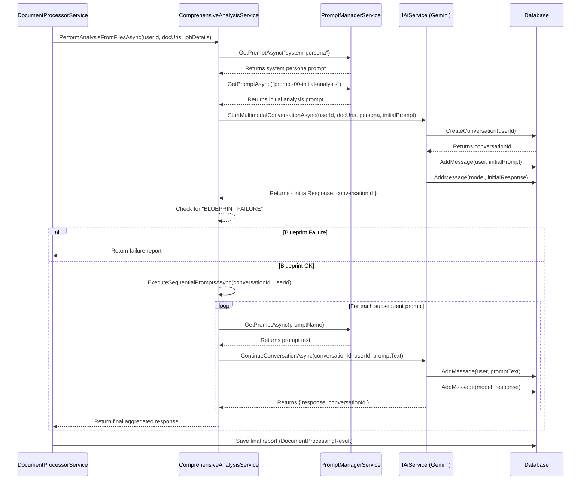

# Technical Design: Stateful Sequential AI Analysis

## 1. Overview

This document outlines the technical design for refactoring the AI analysis workflow from a stateless, one-shot model to a stateful, sequential process. The current implementation uses a single call to the AI service for analysis. The new workflow will support a multi-step conversation, maintaining context between prompts to ensure a more thorough and accurate analysis of blueprint files.

The core of this change is to introduce a stateful conversation that starts with a system persona, performs an initial health check on the provided documents, and then proceeds through a series of specialized prompts if the initial check is successful.

## 2. Proposed Changes

### 2.1. `IAiService` & `GeminiAiService`

To support stateful conversations that begin with file analysis, we need a new method to initiate the conversation and return a handle (`conversationId`) for subsequent interactions.

#### `IAiService.cs`

A new method will be added to the interface:

```csharp
/// <summary>
/// Starts a new stateful, multimodal conversation.
/// </summary>
/// <param name="userId">The ID of the user initiating the conversation.</param>
/// <param name="documentUris">A list of document URIs to be used as the initial context.</param>
/// <param name="systemPersonaPrompt">The initial system persona prompt to set the AI's role.</param>
/// <param name="initialUserPrompt">The first user-facing prompt for the initial analysis.</param>
/// <returns>A tuple containing the initial AI response and the unique conversation ID.</returns>
Task<(string initialResponse, string conversationId)> StartMultimodalConversationAsync(string userId, IEnumerable<string> documentUris, string systemPersonaPrompt, string initialUserPrompt);
```

#### `GeminiAiService.cs`

The new `StartMultimodalConversationAsync` method will be implemented. This method will:
1.  Create a new conversation in the database.
2.  Construct the initial request, including the system persona, the initial user prompt, and the file data from the URIs.
3.  Send the request to the Gemini API.
4.  Store the initial user prompt and the AI's response as the first messages in the conversation.
5.  Return the initial response and the new `conversationId`.

The existing `ContinueConversationAsync` method will be used for all subsequent steps in the sequence.

### 2.2. `ComprehensiveAnalysisService`

This service will be significantly refactored to orchestrate the new sequential workflow. The logic from the obsolete `PerformAnalysisFromTextAsync` will be adapted and merged into `PerformAnalysisFromFilesAsync`.

#### `PerformAnalysisFromFilesAsync` Refactoring

The signature will change to accept a `userId` and `jobDetails` to align with the stateful nature of the process.

**Old Signature:**
`Task<string> PerformAnalysisFromFilesAsync(IEnumerable<string> documentUris, string initialPrompt)`

**New Signature:**
`Task<string> PerformAnalysisFromFilesAsync(string userId, IEnumerable<string> documentUris, JobModel jobDetails)`

**New Logic:**
1.  **Get Prompts:** Fetch the `system-persona` and `prompt-00-initial-analysis` prompts from the `IPromptManagerService`.
2.  **Start Conversation:** Call the new `IAiService.StartMultimodalConversationAsync` method, passing the user ID, document URIs, system persona, and the initial analysis prompt (along with job details). This will return the `initialResponse` and `conversationId`.
3.  **Health Check:** Check if `initialResponse` contains the exact string "BLUEPRINT FAILURE".
    *   **If "BLUEPRINT FAILURE" is found:** The workflow stops. Log the failure and return the failure report to the caller.
    *   **If the check passes:** Log the success and proceed.
4.  **Execute Sequential Prompts:** Call the private `ExecuteSequentialPromptsAsync` method, passing the `conversationId` and `userId`. This method already contains the loop to go through `prompt-01` to `prompt-21`.
5.  **Return Final Response:** The final, aggregated response from the last prompt in the sequence will be returned.

### 2.3. `DocumentProcessorService`

The `ProcessDocumentsForJobAsync` method will be updated to call the refactored `ComprehensiveAnalysisService`.

**Current Call:**
```csharp
string initialPrompt = GenerateInitialPrompt(job);
string finalReport = await _comprehensiveAnalysisService.PerformAnalysisFromFilesAsync(documentUrls, initialPrompt);
```

**Updated Call:**
The `GenerateInitialPrompt` method will no longer be needed in this service, as the `ComprehensiveAnalysisService` now handles prompt construction.

```csharp
var user = await _context.Users.FirstOrDefaultAsync(u => u.Id == job.UserId);
if (user == null) 
{
    // Handle user not found
}

string finalReport = await _comprehensiveAnalysisService.PerformAnalysisFromFilesAsync(user.Id, documentUrls, job);
```

## 3. Data Flow Diagram

Here is a Mermaid diagram illustrating the new workflow:


